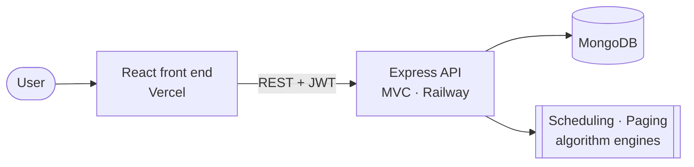

<!-- Template note: same layout as VIRO_README.md. Search for "EDIT:" for the spots that need your repo-specific details. -->

<div align="center">


<a href="https://os-kernel-simulators.vercel.app">
  
</a>

<br/>

<a href="https://os-kernel-simulators.vercel.app"></a>
<a href="https://github.com/AsjidSiddique/OS-Kernel-Simulator"></a>
<a href="https://asjid-siddique-chi.vercel.app/projects/os-kernel-simulator"></a>


<br/>


<br/>


</div>

---

## 🧭 About

**OS Kernel Simulator** is a full-stack web app, built for **CS-330 (Operating Systems)**, that lets you **run and visualize core OS algorithms** — CPU scheduling, page replacement and process synchronization — through an interactive interface with Gantt-chart output.

---

## ✨ Features

### ⚙️ Algorithms

| Area | Implemented |
|---|---|
| **CPU scheduling** | FCFS · SJF · Round Robin · Priority |
| **Page replacement** | FIFO · LRU · Optimal |
| **Synchronization** | Process-synchronization concepts |

### 🖥️ Experience

- 📊 **Interactive Gantt charts** show exactly when each process runs
- 📁 **CSV input** — load a whole set of processes at once
- 🕘 **Simulation history** with pagination
- 🔐 **Accounts & protected routes** — sign in to save and revisit simulations

### 🛡️ Backend engineering

- **MVC REST API** with **15+ endpoints**
- **JWT authentication** · **bcrypt** password hashing
- **Helmet**, **CORS** and **rate limiting** for hardening
- Input validation, **pagination** and **centralized error handling**

---

## 🧠 Algorithms in detail

### CPU scheduling

| Algorithm | Idea | Good at | Watch out for |
|---|---|---|---|
| **FCFS** | First come, first served | Simplicity, no starvation | Convoy effect — short jobs wait behind long ones |
| **SJF** | Shortest burst runs first | Low average waiting time | Starvation of long jobs; needs burst estimates |
| **Round Robin** | Fixed time quantum, rotating queue | Fairness and responsiveness | Quantum choice: too big → FCFS, too small → overhead |
| **Priority** | Highest priority runs first | Favoring important work | Starvation of low priority (fixed by aging) |

### Page replacement

| Algorithm | Idea | Good at | Watch out for |
|---|---|---|---|
| **FIFO** | Evict the oldest page | Very simple | Belady's anomaly — more frames can mean more faults |
| **LRU** | Evict the least recently used page | Strong real-world approximation | Needs recency tracking |
| **Optimal** | Evict the page used farthest in the future | Theoretical minimum faults — the benchmark | Impossible in practice (needs the future) |

<!-- EDIT: if your SJF is preemptive (SRTF), say so in the table. -->

---

## 🏗️ Architecture



<!-- EDIT: add your controller / service / model names if you want a more detailed diagram. -->

---

## 🧰 Tech stack

| Layer | Tools |
|---|---|
| Front end | React · Gantt-chart visualization |
| Back end | Node.js · Express.js · MVC |
| Database | MongoDB |
| Security | JWT · bcrypt · Helmet · CORS · rate limiting |
| Testing | Postman |
| Hosting | Vercel (front end) · Railway (back end) |

---

## 🚀 Getting started

```bash
git clone https://github.com/AsjidSiddique/OS-Kernel-Simulator.git
cd OS-Kernel-Simulator
```

**Backend**

```bash
cd backend                    # EDIT: your folder name
npm install
cp .env.example .env          # EDIT: set the variables below
npm run dev
```

```bash
# EDIT: match your .env.example
MONGO_URI=mongodb+srv://<user>:<password>@<cluster>/<db>
JWT_SECRET=<a-long-random-string>
CLIENT_URL=http://localhost:5173
PORT=5000
```

**Frontend**

```bash
cd frontend                   # EDIT: your folder name
npm install
npm run dev
```

> 🔒 Never commit `.env`. Use a long random `JWT_SECRET` in production.

---

## 🗂️ Project structure

<!-- EDIT: paste the output of `tree -L 2 -I node_modules` -->

```text
OS-Kernel-Simulator/
├── backend/
│   ├── controllers/   # request handling (MVC)
│   ├── models/        # MongoDB schemas
│   ├── routes/        # 15+ REST endpoints
│   ├── middleware/    # auth, validation, rate limit, errors
│   └── algorithms/    # scheduling + page replacement engines
└── frontend/
    └── src/           # React pages, components, Gantt charts
```

---

## 🧪 Try it

1. Open the [live demo](https://os-kernel-simulators.vercel.app) and register / sign in.
2. Add processes manually or upload a CSV.
3. Pick an algorithm (e.g. **Round Robin**, quantum = 2) and run it.
4. Read the Gantt chart, then compare with **SJF** or **Priority** on the same input.

---

## 🔗 Links

| | |
|---|---|
| **🌐 Live demo** | [os-kernel-simulators.vercel.app](https://os-kernel-simulators.vercel.app) |
| **💻 Source code** | [github.com/AsjidSiddique/OS-Kernel-Simulator](https://github.com/AsjidSiddique/OS-Kernel-Simulator) |
| **🗂️ Portfolio case study** | [asjid-siddique-chi.vercel.app/projects/os-kernel-simulator](https://asjid-siddique-chi.vercel.app/projects/os-kernel-simulator) |
| **🧑‍💻 My portfolio** | [asjid-siddique-chi.vercel.app](https://asjid-siddique-chi.vercel.app) |
| **📑 Resume** | [asjid-siddique-chi.vercel.app/resume](https://asjid-siddique-chi.vercel.app/resume) |
| **💼 LinkedIn** | [linkedin.com/in/asjidsiddique469](https://www.linkedin.com/in/asjidsiddique469/) |
| **🐙 GitHub profile** | [github.com/AsjidSiddique](https://github.com/AsjidSiddique) |

### 🚀 More projects

| Project | What it is | Source | Portfolio |
|---|---|---|---|
| **PCBDefect-X** | Deep-learning PCB defect detection | [GitHub](https://github.com/AsjidSiddique/PCBDefect-X) | [Case study](https://asjid-siddique-chi.vercel.app/projects/pcbdefect-x) |
| **FraudShield** | Explainable fraud detection | [GitHub](https://github.com/AsjidSiddique/Fraudshield) | [Case study](https://asjid-siddique-chi.vercel.app/projects/fraudshield) |
| **Viro.pk** | Production e-commerce platform | [GitHub](https://github.com/AsjidSiddique/VIRO) | [Case study](https://asjid-siddique-chi.vercel.app/projects/viro) |

---

## 👨‍💻 Author

<div align="center">

**Asjid Siddique** — Software Engineering student @ NUST · Building toward AI/ML research

<a href="https://asjid-siddique-chi.vercel.app"></a>
<a href="https://github.com/AsjidSiddique"></a>
<a href="https://www.linkedin.com/in/asjidsiddique469/"></a>
<a href="mailto:asjadsaddique4@gmail.com"></a>

<br/><br/>

⭐ If you find this useful, a star on the repo means a lot.


</div>
